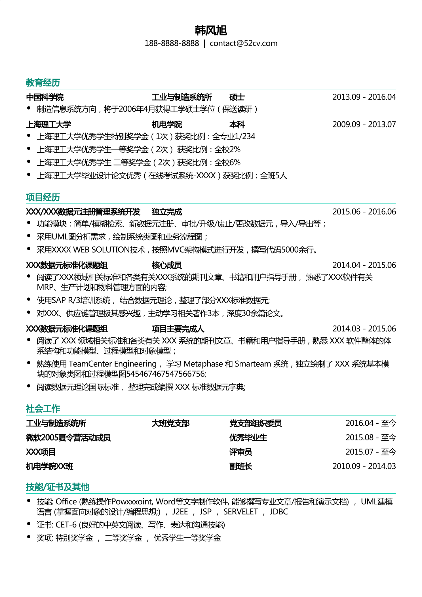

# 简历

# 华南理工

华工，只要导师答应收你，基本就OK了。

一般是通过发邮件的形式联系导师，可以把你的简历和大学三年的成绩单打包发给导师，再配上对自己大学期间的总结，基本就可以了，注意主题要明了详细，不然很容易被放垃圾邮箱去。

说好的八点到却是到了8.45才有人来开门，拿了资料和确定面试时间地点，负责的人还特意提醒我们这次来面试的基本都会过的，上午就算结束了。好困，却紧张得睡不着，看了面试的名单，基本都是211、985大学的，华工本身的学生一堆，紧张中突然有种越战越勇的感觉，不断鼓励自己要加油。面试安排在下午，上午结束之后我就用了ofo单车绕华工一圈了，不错不错，虽然湖没有静湖的漂亮，去到外面的学校才真心体会到自己本科学校的格局环境真是一级的好，身在福中不知福！到了面试时间了，在楼下排队，中间有个小插曲：几个学生迟到了，负责的人半抱怨的说，虽然这次面试基本都过，但是你们也不要那么随意啊！所以，我好想提醒学弟学妹们，如果想保到华南理工，就好好准备简历联系导师！轮到我面试了，华工是面向导师的面试，一般是三个导师一组，有一个组长，三个导师的学生都在这里面试。我的导师是组长，都是他在问我问题，别的老师在一旁看着记录着，首先让我用中文自我介绍一下，再让我详细说说项目经验，基本是问答式的提问，没有太繁琐，例如问我学过什么操作系统，怎么装linux，学过什么数据库，有没有学过hadoop等等，没有太深入的问题，而这些问题大多是根据到导师的研究方向问的，所以不同导师应该不同吧，例如我的同学有被问到网络方面的，数字图像方面的等等。最后，用英语自我介绍结束了这次面试。最后老师喊我在门外等他面试完，出来整个天空都是蓝的。

https://blog.csdn.net/kukajenny/article/details/52855011

许勇老师实验是现在主要有两个方向: 计算机视觉, 推荐系统 (均为深度学习领域)  计算机视觉方向涉及: 图像处理, 3D, 目标检测等. 2020年有多位师兄师姐中CVPR等顶会. 推荐系统方向: 使用热门的embedding技术, 主要使用图神经网络(GNN), Transformer(自然语言处理BERT模型主要模块), 循环神经网络等解决工业热门领域推荐系统的应用问题. 2020年中三篇AAAI, 中SIGIR等会, 21年已投KDD, SIGIR, IJCAI等会  实验室学习氛围浓厚, 毕业师兄师姐有拿腾讯, 阿里offer. 有意的同学请及时联系老师, 询问是否还有名额. 
