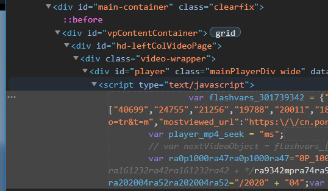
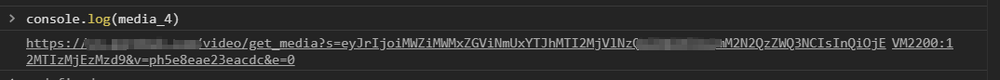

# 基本数据类型的小函数

```javascript
parseInt((a/100).toString());	//小数->字符串->整数
```

# 手动下载某站视频



手动对准网页的视频元素 定位到代码
视频的所有信息都在 `flashvar_301739342`中

`console.log(media_4)`



点这个url进去就有各个清晰度的URL 之后粘贴网址下载就行