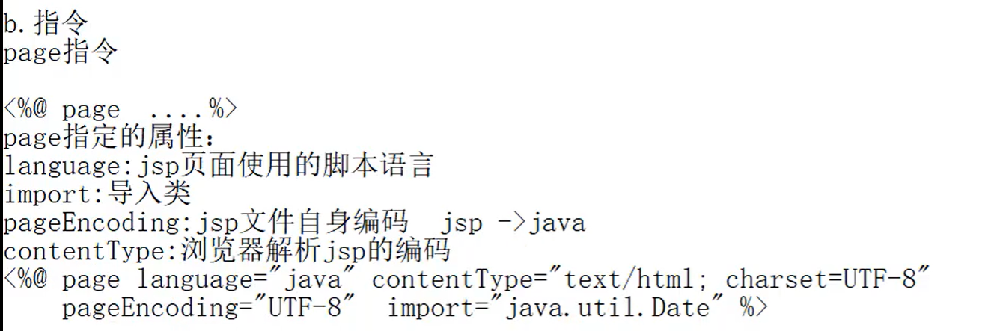
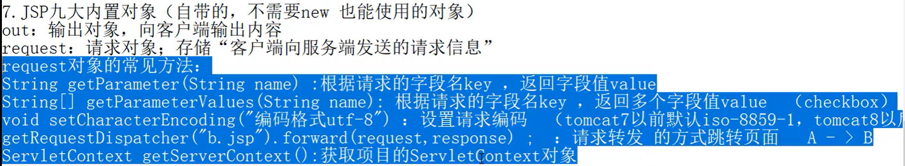
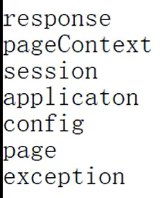
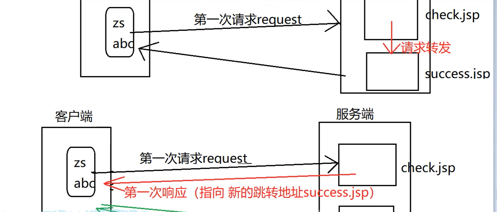
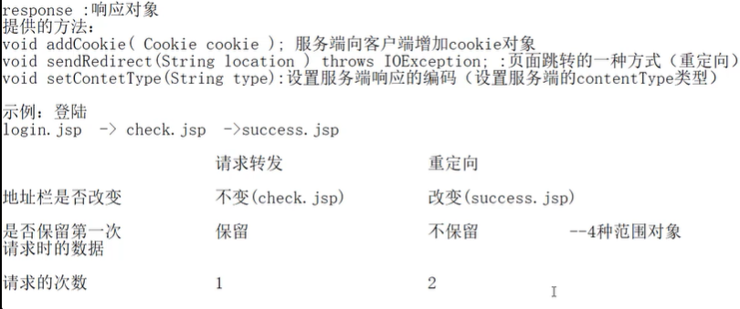

# JSP页面元素

<%
		局部变量、Java语句
%>

<%!
		全局变量、定义方法
%>

<%=
		输出表达式														（可以直接解析html代码
%>

## 九大内置对象

## 请求转发和重定向

## 连接数据库

[使用JDBC连接MySql时出现：The server time zone value '�й���׼ʱ��' is unrecognized or represents more than one time zone. You must configure either the server or JDBC driver (via the serverTimezone configuration](https://www.cnblogs.com/EasonJim/p/6906713.html)

在连接字符串后面加上**?serverTimezone=UTC**

其中UTC是统一标准世界时间。

完整的连接字符串示例：**jdbc:mysql://localhost:3306/test?serverTimezone=UTC**

或者还有另一种选择：**jdbc:mysql://127.0.0.1:3306/test****?useUnicode=true&characterEncoding=UTF-8**，这个是解决中文乱码输入问题，当然也可以和上面的一起结合：**jdbc:mysql://127.0.0.1:3306/test?useUnicode=true&characterEncoding=UTF-8&\**serverTimezone=UTC\****