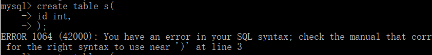
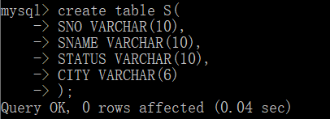
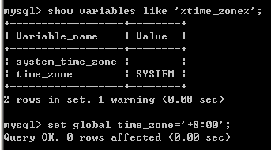

# 启程


启动/停止DBMS：

```mysql
net start mysql80    //mysql80:Service Name
net stop mysql80 
```

服务端登录、退出：

1.直接运行 “MySQL 8.0 Command Line Client”    //仅限于root用户
2.管理员命令行：`mysql -h主机名 -P端口号 -u用户名 -p密码`

# 表的操作

```mysql
create database papi;	//建库
use papi;		//指向papi库
create table t_calss;		//建表
show tables;			//查看所有的表
describe jd_emp;			//看某表结构
select * from stu;			//看某表数据
DROP TABLE runoob_tbl；			//删除表

id int(32),


ALTER TABLE 旧表名 RENAME TO 新表名 ;		//修改表名
alter table users_information change column  phone_number phoneNumber char(16);

update 表名 set column2=value2,columen3=value3 where column1=value1;	//更新行数据

ALTER  TABLE 表名 MODIFY [COLUMN] 字段名 新数据类型 新类型长度  新默认值  新注释;		//修改字段类型、字段名、字段注释、类型长度、字段默认值
 -- COLUMN关键字可以省略不写
 
 alter table 表名 add字段 类型 其他;		//增加表的字段
 mysql> alter table MyClass add passtest int(4) default '0';
```

建表时最后一个属性不加*，*




## 主键添加/删除

建表时添加：

```mysql
create table tableName(
	id int primary key
);
或：
create table tableName(
	id int,
	primary key (id)
);
```

建表后添加/删除：

```mysql
alter table tableName add primary key(id);
alter table tableName drop primary key(id);
```

## 外键添加/删除

建表时添加：

```mysql
create table tableName1(
	tableName2_id int not null,
	foreign key(tableName2_id) references tableName2(id)
);
```

建表后添加/删除：

```mysql
alter table tableName1 add constraint tableName1_ref_tableName2(foreignKeyName) foreign key(tableName2_id) references tableName2(id);

alter table table1 drop foreign key foreignKeyName;
```

# 一些问题

## 用idea连接数据库时

[MySql数据库时区异常，java.sql.SQLException: The server time zone value '?й???׼ʱ?' is unrecognized or represents more than one time zone.](https://www.cnblogs.com/godwithus/p/9788790.html)

JDBC访问MySql异常

Exception in thread "main" org.apache.ibatis.exceptions.PersistenceException:
\### Error querying database. Cause: java.sql.SQLException: The server time zone value '?й???׼ʱ?' is unrecognized or represents more than one time zone. You must configure either the server or JDBC driver (via the serverTimezone configuration property) to use a more specifc time zone value if you want to utilize time zone support.

**原因分析**：

数据库安装时默认为英语，0:00时区

Windows系统中，XP的时区是GMT，而Win7的时区是UTC。

mysql返回的时间会比实际时间要早8小时。


**解决方案**，以下任选一种即可解决问题：

1、配置JDBC连接参数

在url连接字符串后面加上?serverTimezone=UTC

例如：
jdbc:mysql://127.0.0.1:3306/test?characterEncoding=utf8&serverTimezone=UTC

jdbc:mysql://127.0.0.1:3306/test?useUnicode=true&characterEncoding=UTF8&serverTimezone=UTC

学点新知识：

UTC，世界均衡时间

GMT，格林尼治时间

北京时间（东八区），GMT+8，url中表示为：&serverTimezone=GMT%2B8

jdbc:mysql://127.0.0.1:3306/test?characterEncoding=utf8&serverTimezone=GMT%2B8

我们一般认为GMT和UTC是一样的，都与英国伦敦的本地时相同。


2、修改MySQL数据库配置，需要DBA的root权限

使用root用户登录mysql

--查看时区值
show variables like '%time_zone%';

--设置为东八区（北京时间）
set global time_zone='+8:00';

 

3、有人说，使用低版本的MySQL jdbc驱动，5.1.47不会存在时区的问题，的确如此。