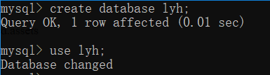

### 一、数据库的安装（MySQL）

#### 下载mysql数据库

​	进入MySQL官网（https://dev.mysql.com/downloads/），选择“MySQL Installer for Windows”下载。同时我也下载了MySQL Workbench作为MySQL的图形界面客户端。

#### 安装MySQL。

​	由于数据库很久之前已经安装过了，没有截图，当时我是按着知乎上的教程进行操作的。

#### 验证是否安装成功

​	打开MySQL 8.0 Command Line Client，输入之前在安装时设置的密码


​	但有时候会遇到输入密码后点回车控制台却没反应的情况，这时候就要检查MySQL服务是否开启。


​	可以在任务管理器手动开启，也可以在cmd敲入`net start mysql80` 命令启动服务。启动后再次输入密码，进入下图场景，即可敲击sql语句对数据库进行操作。


###  二、SQL操作数据库实例

#### 2.1数据定义

##### 2.1.1基本表的定义、删除与修改

**创建数据库**

​    在登陆 MySQL 服务后，使用 `create database lyh` 命令创建数据库，使用`use lyh` 切换到lyh数据库进行操作。



**定义基本表**

​    建立一个“学生”表Student。


​	建立一个“课程”表Crouse。


​	建立一个学生选课表SC。


​	建完表之后我们可以通过`show tables`命令查看当前库中的所有表


> 可以看到，数据库中的表名是不区分大小写的（我创的大写 存进去都成了小写）

**修改基本表**

​	修改表的一般格式为

```mysql
ALTER TABLE<表名>
[ADD [COLUMN] <新列名><数据类型> [完整性约束]]
[ADD <表级完整性约束>]
[DROP [COLUMN] <列名> ]
[DROP CONSTRAINT <完整性约束>]
[ALTER COLUMN <列名> <数据类型>];
```

​	向Student表中增加“入学时间”列，其数据类型为日期型。

​	之后 我使用了`describe tablename`命令查看了talename表的具体结构。可以看到，S_entrance确实被添加进去了。


​	增加课程名称必须取唯一值的约束条件。


**删除基本表**

​	我先随便建了一个test表，然后通过`drop table tablename`删除它。


##### 2.1.2索引的建立与删除

**建立索引**

​	为Student、Courese和SC三个表建立索引。其中Student表按学号升序建唯一索引，Course表按课程号升序建唯一索引，SC表按学号升序和课程号降序建唯一索引。


**修改索引**

​	将SC表的SCno索引改名成SCSno。

​	`ALTER INDEX SCno RENAME TO SCSno`

**删除索引**

​	删除Student表的Stusname索引。

​	`DROP INDEX STUSNAME`


#### 2.2数据更新

##### 2.2.1插入数据

**插入元组**

​	以2.1中创建的三个表为对象，往里面插入数据

​	向MySQL数据表插入数据通用的 **INSERT INTO** SQL语法：

```
INSERT INTO table_name ( field1, field2,...fieldN )
                       VALUES
                       ( value1, value2,...valueN );
```

​	以下我按照书上P79页给的数据，向三个表中插入数据


​	在往Course表中添加数据的时候要注意，因为这里Cpno是外码，而被参照表是本表，被参照列是Cno，在添加数据时要保证Cpno的值要在Cno中存在，否则就会报这个错误：


​	所以，我先给Cpno置NULL了。


​	插入数据上还有很多玩法，如下面我往SC表插入数据时，没有给出SC的属性名，但是在各列上要对应给值，该赋空值赋空值。也可以同时插入多条数据，之间用逗号隔开。


**插入子查询结果**

​	对每一个系，求学生的平均年龄，并把结果存起来。

​	首先建立一个新表，其中一列存放系名，另一列放相应的学生的平均年龄。


​	然后对Student表按系分组求平均年龄，再把系名和平均年龄存到新表中。


​	现在来看下结果吧：


##### 2.2.2修改数据

**修改某一个元组的值**

​	将学生201215121的年龄改为22岁。


​	在2.2.1中创建Course表时有些值本不该是NULL，现在我通过这个语句改一下


来看一下现在的Course表，使用`select *from Course`


**修改多个元组的值**

​	将所有学生的年龄增加1.


**带子查询的修改语句**

​	将计算机科学系全体同学的成绩~~置零~~（置满分！


##### 2.2.3删除数据

**删除某一个元组的值**

​	删除学号为201215128的学生记录


​	hhhh其实表里本来就没有这个数据，所以显示`0 rows affected`

**删除多个元组的值**

​	删除所有学生的选课记录（代价太大了 我删其他表的


**带子查询的删除语句**

​	删除计算机科学系所有学生的选课记录


#### 2.3数据查询

##### 2.3.1单表查询

**选择表中的若干列**

1. 查询指定列

   查询全体学生的学号和姓名

   

   目标列表达式中的各个列的先后顺序可以与表中的不同。

2. 查询全部列

   

3. 查询经过计算的值

   查询全体学生的姓名及其出生年份：

   

   查询全体学生的姓名、出生年份和所在的院系，用小写字母表示系名：

   

   也可以指定别名来改变查询结果的列标题。如下：

   

**选择表中的若干元组**

1. 消除取值重复的行

   直接选择Sno，得到的结果有很多重复的，如下图所示

   

   通过指定`distinct`可以去掉表中重复行。

   

2. 查询满足条件的元组

   使用`where`关键字查询满足条件的元组。

   查询所有年龄在20岁以下的学生姓名和年龄：			关键字where <

   

   查询考试成绩90分以下的学生的学号：			关键字where <


​	查询年龄在20~23岁之间的学生的姓名、系别和年龄：			关键字Between


​	查询年龄不在20~23岁之间的学生的姓名、系别和年龄：			关键字NOT Between


​	查询计算机科学系、数学系和信息系学生的姓名和性别：			关键字where in


​	查询既不是计算机科学系也不是数学系学生的姓名和性别：			关键字where not in


​	查询所有刘姓学生的姓名、学号和性别：			关键字where like %


​	查询所有姓“欧阳”且全名为三个汉字的学生的姓名：			关键字where like _


​	查询名字中第二个字为“阳”的学生的姓名和学号：


​	查询所有不姓刘的学生的姓名、学号和性别：			关键字where not like _


​	查询DB_Design课程的课程号和学分：


​													这里要注意的是`escape '\\'`而不是一个`'\'`    

​	查询以“DB_”开头，且倒数第三个字符为i的课程的详细情况：


​	查询缺少成绩的学生的学号和相应的课程号：


​	查询所有有成绩的学生的学号和课程号：


​	查询计算机科学系年龄在20岁以下的学生姓名：


​	

**ORDER BY 子句**

​	查询选修了3号课程的学生的学号及其成绩，查询结果按分数的降序排序：


​	查询全体学生情况，查询结果按所在系的系号升序排列，同一系中的学生按降序排列：


**聚集函数**

​	查询学生总人数：


​		查询选修了课程的学生人数：


​	计算选修1号课程的学生的平均成绩：


查询选修1号课程的学生最高分数


​	查询学生201215121选修课程的总学分数：


**GROUP BY 子句**

​	求各个课程号及相应的选课人数：


​	查询选修了三门以上课程的学生学号：


​	查询平均成绩大于等于90分的学生学号和平均成绩：


##### 2.3.2连接查询

**等值与非等值查询**

​	查询每个学生及其选修课程的情况：


​	用自然连接查询每个学生及其选修课程的情况：


​	查询选修2号课程且成绩在90分以上的所有学生的学号及姓名：


**自身连接**

​	查询每一门课的间接先修课：


**外连接**

​	


**多表连接**

​	查询每个学生的学号、姓名、选修的课程名及成绩：


##### 2.3.3嵌套查询

**带有IN谓词的嵌套查询**

​	查询与“刘晨”在同一个系的学生：		（不相关子查询）


​	查询选修了课程名为“信息系统“的学生学号及姓名：	（不相关子查询）


**带有比较运算符的子查询**

​	找出每个学生超过他自己选修课程平均成绩的课程号：		（相关子查询）


**带有ANY（SOME）或ALL谓词的子查询：**

​	查询非计算机科学系中比计算机科学系任意一个学生年龄小的学生姓名和年龄：


​		查询非计算机科学系中比计算机科学系所有学生年龄都小的学生姓名及年龄：


**带有EXISTS谓词的子查询**

​	查询所有选修了1号课程的学生姓名：


​	查询没有选修1号课程的学生的姓名：


​	查询选修了所有课程的学生姓名：


​	查询至少选修了学生201215122选修的全部课程的学生的号码：

> 其所表达的语义也可以转化为：不存在这样的课程y，学生201215122选修了y，而学生x没有选


##### 2.3.4集合查询

<u>集合查询主要包括并操作UNION、交操作INTERSECT和差操作EXCEPT。</u>

​	查询计算机科学系的学生及年龄不大于19岁的学生：


查询选修了课程1或者选修了课程2的学生：


查询计算机科学系的学生与年龄不大于19岁的学生的交集：

​	我的MySQL并不支持书上的INTERSECT关键字，因此我用AND关键字实现：


查询计算机科学系的学生与年龄不大于19岁的学生的差集：

​	MySQL也不支持书上的EXCEPT关键字，因此我用AND关键字实现：


### 三、尝试触发器