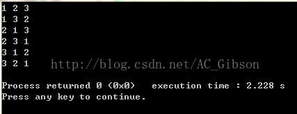
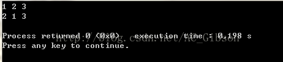
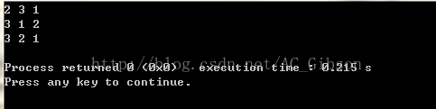
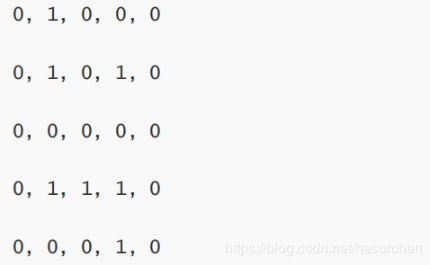
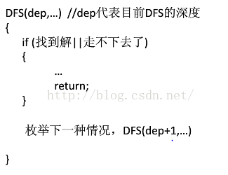
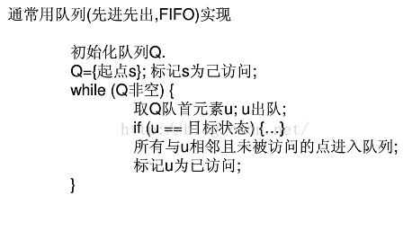

# 一些小函数

> vector容器的大小：`a.size()`
>
> char数组的实际大小：`strlen(a)`
>
> string大小：`s.length();`
>

取整函数	ceil()	floor()


## 判断字符串  

```c++
#include<cctype>
int isalpha ( int c );			//判断是否为字母
int isdigit ( int c);			//判断是否为0-9数字
```

## 字符串切割

### 通过string成员函数实现

在C++ string类中，提供了两个成员函数可以用来实现字符串分割，一个是find函数，另一个是substr函数，下面看一下这两个函数的声明。
 **find**函数:
 原型： `size_t find (const string& str, size_t pos = 0) const;`
 功能：查找子字符串第一次出现的位置。
 参数说明：str为子字符串，pos为初始查找位置。
 返回值：找到的话返回第一次出现的位置，否则返回string::npos。
 **substr**函数:
 原型： `string substr (size_t pos = 0, size_t len = npos) const;`
 功能：在原字符串中截取子字符串。
 参数说明：pos为起始位置，len为要截取子字符串的长度。
 返回值：子字符串。


## atoi() 和 stoi()

相同点：
①都是C++的字符处理函数，把数字字符串转换成int输出
②头文件都是#include<cstring>

不同点：
①atoi()的参数是 const char* ,因此对于一个字符串str我们必须调用 c_str()的方法把这个string转换成 const char*类型的,而stoi()的参数是const string*,不需要转化为 const char*；
②stoi()会做范围检查，默认范围是在int的范围内的，如果超出范围的话则会runtime error！

```c++
cout<<atoi(s3);		//报错
cout<<atoi(s3.c_str());		//正确

// stoi example
#include <iostream>   // std::cout
#include <string>     // std::string, std::stoi

int main ()
{
  string str_dec = "2001, A Space Odyssey";
  string str_hex = "40c3";
  string str_bin = "-10010110001";
  string str_auto = "0x7f";

  std::string::size_type sz;   // alias of size_t

  int i_dec = stoi (str_dec,&sz);
  int i_hex = stoi (str_hex,nullptr,16);
  int i_bin = stoi (str_bin,nullptr,2);
  int i_auto = stoi (str_auto,nullptr,0);

  std::cout << str_dec << ": " << i_dec << " and [" << str_dec.substr(sz) << "]\n";
  std::cout << str_hex << ": " << i_hex << '\n';
  std::cout << str_bin << ": " << i_bin << '\n';
  std::cout << str_auto << ": " << i_auto << '\n';

  return 0;
}

/*输出：
2001，《太空漫游》：2001和[，《太空漫游》
40c3：16579
-10010110001：-1201
0x7f：127
*/
```


## to_string()

```c++
// to_string example
#include <iostream>   // std::cout
#include <string>     // std::string, std::to_string

int main ()
{
  std::string pi = "pi is " + std::to_string(3.1415926);
  std::string perfect = std::to_string(1+2+4+7+14) + " is a perfect number";
  std::cout << pi << '\n';
  std::cout << perfect << '\n';
  return 0;
}

/*输出：
pi is 3.141593
28 is a perfect number
*/
```

## lower_bound upper_bound

头文件： #include  <algorithm>

二分查找的函数有 3 个： [
](https://www.cnblogs.com/cunyusup/p/8438749.html)

lower_bound(起始地址，结束地址，要查找的数值) 返回的是数值 **第一个** 出现的位置。

upper_bound(起始地址，结束地址，要查找的数值) 返回的是 第一个大于待查找数值 出现的位置。

binary_search(起始地址，结束地址，要查找的数值)  返回的是是否存在这么一个数，是一个**bool值**。

注意：使用二分查找的前提是数组有序。

 

1 函数lower_bound()  参考：[有关lower_bound()函数的使用](https://www.cnblogs.com/is-Tina/p/7294067.html)

 

功能：函数lower_bound()在first和last中的前闭后开区间进行二分查找，返回**大于或等于val的第一个元素位置**。如果所有元素都小于val，则返回last的位置.

注意：如果所有元素都小于val，则返回last的位置，且last的位置是**越界**的！！

 

2 函数upper_bound()

 

功能：函数upper_bound()返回的在前闭后开区间查找的关键字的上界，返回**大于val**的第一个元素位置

注意：返回查找元素的最后一个可安插位置，也就是“元素值>查找值”的第一个元素的位置。同样，如果val大于数组中全部元素，返回的是last。(注意：数组下标越界)

 

**PS**：

​    lower_bound(val):返回容器中第一个值【大于或等于】val的元素的iterator位置。

​    upper_bound(val): 返回容器中第一个值【大于】val的元素的iterator位置。

例子：

```
void main()
{
    vector<int> t;
    t.push_back(1);
    t.push_back(2);
    t.push_back(3);
    t.push_back(4);
    t.push_back(6);
    t.push_back(7);
    t.push_back(8);

    
    int low=lower_bound(t.begin(),t.end(),5)-t.begin();
    int upp=upper_bound(t.begin(),t.end(),5)-t.begin();
    cout<<low<<endl;
    cout<<upp<<endl;
	return 0;
}
```

## next_permutation

next_permutation(iterator.begin(),iterator.end(),cmp)

参见https://blog.csdn.net/HowardEmily/article/details/68064377

全排列参考了两位的博客 感谢!

http://blog.sina.com.cn/s/blog_9f7ea4390101101u.html

http://blog.csdn.net/ac_gibson/article/details/45308645

  组合数学中经常用到排列，这里介绍一个计算序列全排列的函数：next_permutation（start,end），和prev_permutation（start,end）。这两个函数作用是一样的，区别就在于前者求的是当前排列的下一个排列，后一个求的是当前排列的上一个排列。至于这里的“前一个”和“后一个”，我们可以把它理解为序列的字典序的前后，严格来讲，就是对于当前序列pn，他的下一个序列pn+1满足：不存在另外的序列pm，使pn<pm<pn+1.

 

对于next_permutation函数，其函数原型为：

   \#include <algorithm>

   bool next_permutation(iterator start,iterator end)

当当前序列不存在下一个排列时，函数返回false，否则返回true

我们来看下面这个例子：

```c++
#include <iostream> 
#include <algorithm> 
using namespace std; 
int main() 
{ 
  int num[3]={1,2,3}; 
  do 
  {cout<<num[0]<<" "<<num[1]<<" "<<num[2]<<endl; 
  }while(next_permutation(num,num+3)); 
  return 0; 
}
```

输出结果为：



当我们把while(next_permutation(num,num+3))中的3改为2时，输出就变为了：



由此可以看出，next_permutation(num,num+n)函数是对数组num中的前n个元素进行全排列，同时并改变num数组的值。

另外，需要强调的是，next_permutation（）在使用前需要对欲排列数组按升序排序，否则只能找出该序列之后的全排列数。比如，如果数组num初始化为2,3,1，那么输出就变为了：



 

此外，next_permutation（node,node+n,cmp）可以对结构体num按照自定义的排序方式cmp进行排序。
也可以对字符...
next_permutation 自定义比较函数 POJ 1256

题目中要求的字典序是`'A'<'a'<'B'<'b'<...<'Z'<'z'.`

```cpp
#include<iostream> //poj 1256 Anagram
#include<string>
#include<algorithm>
using namespace std;
int cmp(char a,char b) 
{
 if(tolower(a)!=tolower(b))//tolower 是将大写字母转化为小写字母.
 return tolower(a)<tolower(b);
 else
 return a<b;
}
int main()
{
 char ch[20];
 int n;
 cin>>n;
 while(n--)
{
scanf("%s",ch);
sort(ch,ch+strlen(ch),cmp);
 do
{
printf("%s\n",ch);
}while(next_permutation(ch,ch+strlen(ch),cmp));
}
 return 0;
}
```

 

# 输入输出

连续使用scanf时遇到的问题https://www.cnblogs.com/qxj511/p/5218279.html

## C库标准输入输出：

### **getchar、putchar**

`int getchar(void)`		
单次从缓冲区读入一个（无符号）字符，无参，返回int
函数的返回值为用户输入的第一个字符的ASCII码，若出错返回-1，且将用户输入的字符回显到屏幕。如果用户在按回车键之前输入了不只一个字符，**其他字符会保留在键盘缓冲区中**，等待后续getchar()调用读取。也就是说，后续的getchat()调用不会等待用户按键，而是直接读取缓冲区中的字符，直到缓冲区的字符读取完毕后，才等待用户按键。

`int putchar(int char)`	
输出一个字符到控制台

> putchar()非真正函数，而是putc(ch, stdout)宏定义。

```c++
char c;
for(int i=0;i<5;i++){
    c=getchar()+4;
    putchar(c);
}
/*
输入China
输出Glmre
*/
```


## 格式化输出

**printf格式输出数字，位数不够前面补0**

```c++
int a = 4;
printf("%03d",a);
/*输出：
004
*/
//也可以用 * 代替位数，在后面的参数列表中用变量控制输出位数；
int a = 4;
int n = 3;
printf("%0*d",n,a);
输出：004
```

printf格式输出数字，保留小数点

```c++
float p=1f;
printf("%5.2f",p);
/*输出：
  1.00
*///两空格，共5位宽度
printf("%-5.2f",p);
/*输出：
1.00  
*///两空格，共5位宽度，左对齐
```

#### cpp保留任意小数点位数

```cpp
#include<iostream>
using namespace std;
int main(){
    double PI=3.1415926;
    cout<<setprecision(3)<<PI<<endl;
    return 0;//3.14三位有效数
}
```


# 结构体

## 构造函数

在建立结构体数组时,如果只写了带参数的构造函数将会出现数组无法初始化的错误！！！各位同学要牢记呀！
下面是一个比较安全的带构造的结构体示例

```cpp
struct node{
    int data;
    string str;
    char x;
    //注意构造函数最后这里没有分号哦！
  node() :x(), str(), data(){} //无参数的构造函数数组初始化时调用
  node(int a, string b, char c) :data(a), str(b), x(c){}//有参构造
}N[10];

int main()
{
	  N[0] = { 1,"hello",'c' };  
	  N[1] = { 2,"c++",'d' };    //无参默认结构体构造体函数
	  N[2].init(3, "java", 'e'); //自定义初始化函数的调用
	  N[3] = node(4, "python", 'f'); //有参数结构体构造函数
	  N[4] = { 5,"python3",'p' };
	for (int i = 0; i < 5; i++){
		cout << N[i].data << " " << N[i].str << " " << N[i].x << endl;
	}
	return 0;
}
```


## 体排序

```c++
#include<bits/stdc++.h>
using namespace std;
typedef struct{
	string name,id;
	int score;
}stu; 

bool cmp(stu &a,stu &b)            //当return的是ture时，a先输出，所以是升序
{
     return a.score < b.score;
}
int main(){
	stu li[n];
    //li的初始化
	sort(li,li+n,cmp);
	return 0;
}
```

# 容器


`li.at(0)===li.begin()===li.front`

```
   v2.erase(v2.begin()); //删除开头的元素
 
   v2.erase(v2.begin(),v2.end); //删除[begin,end]区间的元素
 
   v2.pop_back();   //删除最后一个元素
   函数                                   说明
 
c.assign(beg,end)            //将[beg; end)区间中的数据赋值给c。
 
c.assign(n,elem)             //将n个elem的拷贝赋值给c。
    
c.at(idx)                    //传回索引idx所指的数据，如果idx越界，抛出out_of_range。
    
c.back()                     //传回最后一个数据，不检查这个数据是否存在。
    
c.begin()                    //传回迭代器中的第一个数据地址。
    
c.capacity()                 //返回容器中数据个数。
    
c.clear()                    //移除容器中所有数据。
    
c.empty()                    //判断容器是否为空。
 
c.end()                      //指向迭代器中的最后一个数据地址。
 
c.erase(pos)                 //删除pos位置的数据，传回下一个数据的位置。
 
c.erase(beg,end)             // 删除[beg,end)区间的数据，传回下一个数据的位置。
 
c.front()                    //传回第一个数据。
    
get_allocator                //使用构造函数返回一个拷贝。
    
c.insert(pos,elem)           //在pos位置插入一个elem拷贝，传回新数据位置。
 
c.insert(pos,n,elem)         //在pos位置插入n个elem数据。无返回值。
 
c.insert(pos,beg,end)        //在pos位置插入在[beg,end)区间的数据。无返回值。
    
c.max_size()                 //返回容器中最大数据的数量。
    
c.pop_back()                 //删除最后一个数据。
    
c.push_back(elem)            //在尾部加入一个数据。
 
c.rbegin()                   //传回一个逆向队列的第一个数据。
    
c.rend()                     //传回一个逆向队列的最后一个数据的下一个位置。
 
c.resize(num)                //重新指定队列的长度。
 
c.reserve()                  //保留适当的容量。
 
c.size()                     //返回容器中实际数据的个数。
 
c1.swap(c2)                  //将c1和c2元素互换。
 
swap(c1,c2)                  //同上操作。
    
vector<Elem> c               //创建一个空的vector。
 
vector<Elem> c1(c2)          //复制一个vector。
 
vector <Elem> c(n)           //创建一个vector，含有n个数据，数据均已缺省构造产生。
 
vector <Elem> c(n, elem)     //创建一个含有n个elem拷贝的vector。
 
vector <Elem> c(beg,end)     //创建一个以[beg;end)区间的vector。
 
c.~ vector <Elem>()          //销毁所有数据，释放内存。
    
operator[]                   //返回容器中指定位置的一个引用。
```


## SET

Unordered sets are containers that store unique elements in no particular order, and which allow for fast retrieval of individual elements based on their value.

set关联式容器。set作为一个容器也是用来存储同一数据类型的数据类型，并且能从一个数据集合中取出数据，在set中每个元素的值都唯一，而且系统能根据元素的值自动进行排序。https://blog.csdn.net/yas12345678/article/details/52601454

**判断元素是否在集合set中**

`s.count(q)`			在了返回1 反之返回0
`s.find(q)`				在了返回所在迭代器，反之返回s.end()

**erase(iterator) ,删除定位器iterator指向的值**

**erase(first,second),删除定位器first和second之间的值**

**erase(key_value),删除键值key_value的值**

set进去的元素也是默认**升序**的	若要降序 自己写

```c++
template<class _Ty = void>
struct more
	: public binary_function<_Ty, _Ty, bool>
{	// functor for operator<
	bool operator()(const _Ty& _Left, const _Ty& _Right) const
	{	// apply operator< to operands
		return (_Left > _Right);
	}
};

set<int,more<int>> s;
```


## Map

> map就是从键（key）到值（value）的映射。因为重载了 [ ] 运算符，map更像是数组的“高级版”。例如可以用一个map< string,int>month_name来表示“月份名字到月份编号”的映射，然后用 month_name[“July”]=7 这样的方式来赋值。

所有元素会根据key值排序（默认升序，如果键值为字符串就是字典序），map中的所有元素都是pair，同时拥有实值和键值，pair的**first为键值**，**second为实值**，底层将它的first作为红黑树的排序key。
map不允许有两个相同键值的元素。map的迭代器不能修改键值，但可以修改实值。主要用于处理带有键值的记录性元素数据的快速插入、删除和检索。

- 创建map对象

```
    map<string,double> m;
```

- 插入和访问
  （访问时如果map中不存在该键值，实值为空，对于数字则为0，字符串则为空串。）

```
    m["Jack"]=98.5;
    cout<<m["Jack"]<<endl;
    m.insert(make_pair("test3",3 ));
```

- 遍历

```
    map<string,double>::iterator it;
    for(it=m.begin();it!=m.end();it++)
        cout<<(*it).first<<":"<<(*it).second<<endl;123
```

- 删除

```
    //通过键值删除
    m.erase("Jack");

    //清空
    m.clear();12345
```

还有一种方法是遍历删除，既可以通过键值，也可以通过实值，不过由于迭代器的属性，这种方法不注意的话很容易出错。这里贴两个大神的链接：
[c++ 关于map的遍历 删除](http://blog.csdn.net/windren06/article/details/8141921)
[c++如何遍历删除map/vector里面的元素](http://www.cnblogs.com/dabaopku/p/3912662.html)

- 查找
  使用键值进行查找操作。大多数情况**直接用键值访问**就行了，很少用到下面的m.find()

> Searches the container for an element with a *key* equivalent to *k* and returns an iterator to if found,otherwise it returns an iterator to map::end

1.用find函数来定位键值出现位置，它返回的一个迭代器，当键值出现时，它返回所在位置的迭代器，如果map中没有要查找的键值，它返回的迭代器等于end函数返回的迭代器

```
    map<string,double>::iterator it;
    it=m.find("Jack");
    cout<<(*it).first<<":"<<(*it).second<<endl;

    //等价于

    cout<<"Jack"<<":"<<m["Jack"]<<endl;
12345678
```

2.用count函数来判定键值是否出现，count函数的返回值只有两个，键值出现返回1，否则返回0

```
    if(m.count("Jack"))
        cout<<"FOUND"<<endl;
    else
        cout<<"NOT FOUND"<<endl;

    //等价于

    if(m["Jack"])
        cout<<"FOUND"<<endl;
    else
        cout<<"NOT FOUND"<<endl;
```

插入<key, value>键值对时，默认按照key的字典序**升序**less存储**。这也是作为key的类型必须能够进行<运算比较的原因。现在我们用string类型作为key，因此，我们的存储就是按学生姓名的字典排序储存的。

```cpp
template < class Key, class T, class Compare = less<Key>,
           class Allocator = allocator<pair<const Key,T> > > class map;
```

`class Compare = less<Key>`

```c++
template <class T> struct less : binary_function <T,T,bool> {
  bool operator() (const T& x, const T& y) const
    {return x<y;}
};
```

它是一个带模板的struct，里面仅仅对()运算符进行了重载，实现很简单，但用起来很方便，这就是函数对象的优点所在。stl中还为四则运算等常见运算定义了这样的函数对象，与less相对的还有greater：

```cpp
template <class T> struct greater : binary_function <T,T,bool> {
  bool operator() (const T& x, const T& y) const
    {return x>y;}
};
```

map这里指定less作为其默认比较函数(对象)，所以我们通常如果不自己指定Compare，map中键值对就会按照Key的less顺序进行组织存储，因此我们就看到了上面代码输出结果是按照学生姓名的字典顺序输出的，即string的less序列。

我们可以在定义map的时候，指定它的第三个参数Compare，比如我们把默认的less指定为greater，就按照key的字典序降序排列了

我们自己写一个函数对象，实现想要的逻辑，定义map的时候把Compare指定为我们自己编写的这个就ok啦。

```cpp
struct CmpByKeyLength {
  bool operator()(const string& k1, const string& k2) {
    return k1.length() < k2.length();
  }
};
map<string, int, CmpByKeyLength> name_score_map;
```

https://blog.csdn.net/iicy266/article/details/11906189

# Dijkstra

```c++
Dijkstra() {
  初始化;
  for(循环n次) {
    u = 使dis[u]最小的还未被访问的顶点的编号;
    记u为确定值;
    for(从u出发能到达的所有顶点v){
      if(v未被访问 && 以u为中介点使s到顶点v的最短距离更优)
        优化dis[v];
    }
  }
}
```

```c++
//邻接矩阵
int n, e[maxv][maxv];
int dis[maxv], pre[maxv];// pre用来标注当前结点的前一个结点
bool vis[maxv] = {false};
void Dijkstra(int s) {
  fill(dis, dis + maxv, inf);
  dis[s] = 0;
  for(int i = 0; i < n; i++) pre[i] = i; //初始状态设每个点的前驱为自身
  for(int i = 0; i < n; i++) {
    int u = -1, minn = inf;
    for(int j = 0; j < n; j++) {
      if(visit[j] == false && dis[j] < minn) {
        u = j;
        minn = dis[j];
      }
    }
    if(u == -1) return;
    visit[u] = true;
    for(int v = 0; v < n; v++) {
      if(visit[v] == false && e[u][v] != inf && dis[u] + e[u][v] < dis[v]) {
        dis[v] = dis[u] + e[u][v];
        pre[v] = u; // pre用来标注当前结点的前一个结点
      }
    }
  }
}
```

```c++
//邻接表
struct node {
  int v, dis;
}
vector<node> e[maxv];
int n;
int dis[maxv], pre[maxv];// pre用来标注当前结点的前一个结点
bool vis[maxv] = {false};
for(int i = 0; i < n; i++) pre[i] = i; //初始状态设每个点的前驱为自身
void Dijkstra(int s) {
  fill(dis, dis + maxv, inf);
  dis[s] = 0;
  for(int i = 0; i < n; i++) {
    int u = -1, minn = inf;
    for(int j = 0; j < n; j++) {
      if(visit[j] == false && dis[j] < minn) {
        u = j;
        minn = dis[j];
      }
    }
    if(u == -1) return ;
    visit[u] = true;
    for(int j = 0; j < e[u].size(); j++) {
      int v = e[u][j].v;
      if(visit[v] == false && dis[u] + e[u][j].dis < dis[v]) {
        dis[v] = dis[u] + e[u][j].dis;
        pre[v] = u;
      }
    }
  }
}
```

# 搜索算法

BFS（广度优先搜索）：发散性寻找（分身寻找）

DFS（深度优先搜索）：不撞南墙不回头

**以经典例题：迷宫问题为例**

**画个迷宫1表示墙，0表示路。**


**DFS思想**

从起点开始，沿着一条路一直走到底，若是发现不能到达目标解，那就返回到上一个节点，而后从另外一条路开始走到底（即尽可能往深处走）svg

**BFS思想**

从起点开始，逐层寻找（发散性寻找）（即往四周走）

**DFS优势：消耗内存少 （容易时间超限）**

**BFS优势：消耗时间少 （容易内存超限）**

**DFS适合题目类型：给定初始状态跟目标状态，要求判断从初始状态到目标状态是否有解。**

**BFS适合题目类型：给定初始状态跟目标状态，要求求出从初始状态到目标状态的最优解。**

例如：上述的迷宫问题。
如果问：从迷宫左上角到迷宫右下角是否存在路径长度为9的路径，则用DFS。
如果问：从迷宫左上角到迷宫右下角的最短路径是多少，则用BFS。

## DFS

柳婼笔记https://www.liuchuo.net/archives/tag/dfs

DFS--基本入门模板 和 例题 （绝对入门） (最全)

https://blog.csdn.net/qq_40763929/article/details/81629800?biz_id=102&utm_term=DFS&utm_medium=distribute.pc_search_result.none-task-blog-2~all~sobaiduweb~default-3-81629800&spm=1018.2118.3001.4187



## BFS

#### 



# 欧拉回路的判断

## 基础概念

首先来看一下离散数学中的一些基础概念：
**通路**：在无向图中由点边交替组成的序列就是通路（如果这个图是简单的，那么也可以使用点的序列来表示），如果首尾的点相同，则称为一条回路
**无向图的连通性**：无向图中任意一对点之间均有通路
**欧拉通路**：从某个顶点出发，将所有的边遍历一遍并且仅经过一遍的通路序列称为欧拉通路，连通的多重图有欧拉回路而无欧拉回路当且仅当它恰有两个奇数度顶点
这里说明了欧拉通路的条件：

- 图是连通的，没有孤立节点
- 对于无向图来说，奇数度的顶点为2个，这两个顶点分别是起点以及终点（0个的话就是回路了）

**欧拉回路**：如果欧拉通路的起点与终点一样，则成为欧拉回路， 连通的多重图具有欧拉回路当且仅当它的每个顶点都有偶数度
则欧拉回路的条件：

- 图是连通的，没有孤立节点
- 无向图的每个节点的度数都是偶数度，有向图每个节点的入度等于出度

## 判断图是否存在欧拉回路

根据判断的条件，首先是判断图的连通性，然后判断图的每个节点的度数是否是偶数就可以了：

例如，这个题目：

链接：https://www.nowcoder.com/questionTerminal/0ba5d8f525494a8787aaa9d53b5f9b9e
来源：牛客网

输入描述:

测试输入包含若干测试用例。每个测试用例的第1行给出两个正整数，分别是节点数N ( 1 < N < 1000 )和边数M；随后的M行对应M条边，每行给出一对正整数，分别是该条边直接连通的两个节点的编号（节点从1到N编号）。当N为0时输入结束。

输出描述:

每个测试用例的输出占一行，若欧拉回路存在则输出1，否则输出0。
示例1
输入

3 3
1 2
1 3
2 3
3 2
1 2
2 3
0
输出

1
0

**代码**

```c++
#include<stdio.h>
#include<stdlib.h>
#include<memory.h>
#include<algorithm>
#include<iostream>
using namespace std;
#define N 1005
int n,m;
int a,b;
int degree[N];
int tree[N];

int findroot(int x){               //并查集的方式判断图连通性
    if(tree[x]==-1)
        return x;
    else{
        int temp = findroot(tree[x]);
        tree[x] = temp;
        return temp;
    }
}
int main(){
    while(cin>>n && n){
        cin>>m;
        memset(tree, -1, sizeof(tree));
        memset(degree, 0, sizeof(degree));
        for(int i=0; i<m; i++){
            cin>>a>>b;
            int tempa = findroot(a);
            int tempb = findroot(b);
            if(tempa != tempb)
                tree[tempa] = tempb;
            degree[a]++;                //无向图记录度数
            degree[b]++;
        }
        int flag = 0;
        int ans = 0;
        for(int i=1; i<= n; i++){     //判断连通性
            if(tree[i]==-1)
                ans++;
        }
        for(int i=1; i<=n; i++){    //判断度数
            if(degree[i]%2){
                flag = 1;
                break;
            }
        }
        if(ans > 1 || flag)
            cout<<"0"<<endl;
        else
            cout<<"1"<<endl;
    }
}
```

# 树

二叉树的两个常见概念
 **full binary tree 满二叉树**：二叉树除了叶结点外所有节点都有两个子节点。
 对于满二叉树而言，叶子的个数等于内部结点（非叶结点）+1，写作 L = l + 1


full binary tree


**complete binary tree 完全二叉树**：从根往下数，除了最下层外都是全满（都有两个子节点），而最下层所有叶结点都向左边靠拢填满。
 构造一颗完全二叉树就是**【从上到下，从左往右】**的放置节点。


complete binary tree


如下图：

- 左侧为满二叉树但不是完全二叉树，要补全的话可以给第二层最左节点下加两个子节点，或删除当前最下层的两个节点【】。

- 右侧是一颗完全二叉树但并不是满二叉树，因为最下层最后一个节点没有兄弟节点，即其父节点只有一个子节点，不满，补满的话再加一个右子节点即可

  【满二叉树的节点要么没孩子，要有就一定得是俩】

  。

  

# 约瑟夫环

https://blog.csdn.net/u011500062/article/details/72855826

# 未解决的问题

双蛋问答

https://blog.csdn.net/u010833547/article/details/105027015

https://blog.csdn.net/jacicson1987/article/details/104935989

```C++

#include<stdio.h>
#define Max(a,b) (a>b?a:b)
#define Min(a,b) (a<b?a:b)
int dp[1005][50];
int main(int argc, char* argv[])
{
	int n,m;
	scanf("%d%d",&n,&m);
	for (int i=1;i<=n;i++)
    {
        dp[i][1]=i;
    }
    for (int cnt=2;cnt<=m;cnt++)
    {
        for (int ind=1;ind<=n;ind++)
        {
            dp[ind][cnt]=1+dp[ind-1][cnt];
            for (int k=2;k<=ind;k++)
                dp[ind][cnt]=Min(dp[ind][cnt],1+Max(dp[k-1][cnt-1],dp[ind-k][cnt]));
        }
    }
    printf("%d\n",dp[n][m]);
	return 0;
}
```

# 01背包

https://www.jianshu.com/p/a66d5ce49df5   小朋友视角	

# 查重

## 	二进制查重

### 		异或去重

异或是一种基于二进制的位运算，用符号XOR或者 ^ 表示，其运算法则是对运算符两侧数的每一个二进制位，同值取0，异值取1。它与布尔运算的区别在于，当运算符两侧均为1时，布尔运算的结果为1，异或运算的结果为0。

    异或的性质：
    
    1、交换律：a^b = b^a；
    
    2、结合律：(a^b)^c = a^(b^c)；
    
    3、对于任意的a：a^a=0，a^0=a，a^(-1)=~a。
    
    了解了上面这些，来看看这个，很重要，后面的程序都要用到这个结论：
    
    对于任意的a，有a^b^c^d^a^k = b^c^d^k^(a^a) = b^c^d^k^0 = b^c^d^k，也就是说，如果有多个数异或，其中有重复的数，则无论这些重复的数是否相邻，都可以根据异或的性质将其这些重复的数消去，具体来说，如果重复出现了偶数次，则异或后会全部消去，如果重复出现了奇数次，则异或后会保留一个。

下面来看两道题目：

1-1000放在含有1001个元素的数组中，只有唯一的一个元素值重复，其它均只出现一次。每个数组元素只能访问一次，设计一个算法，将它找出来；不用辅助存储空间，能否设计一个算法实现？

当然，这道题，可以用最直观的方法来做，将所有的数加起来，减去1+2+3+...+1000的和，得到的即是重复的那个数，该方法很容易理解，而且效率很高，也不需要辅助空间，唯一的不足时，如果范围不是1000，而是更大的数字，可能会发生溢出。

我们考虑用异或操作来解决该问题。现在问题是要求重复的那个数字，我们姑且假设该数字式n吧，如果我们能想办法把1-1000中除n以外的数字全部异或两次，而数字n只异或一次，就可以把1-1000中出n以外的所有数字消去，这样就只剩下n了。我们首先把所有的数字异或，记为T，可以得到如下：

```
T = 1^2^3^4...^n...^n...^1000 = 1^2^3...^1000（结果中不含n）
```

而后我们再让T与1-1000之间的所有数字（仅包含一个n）异或，便可得到该重复数字n。如下所示：

```
T^(a^2^3^4...^n...^1000) = T^(T^n) = 0^n = n
```

